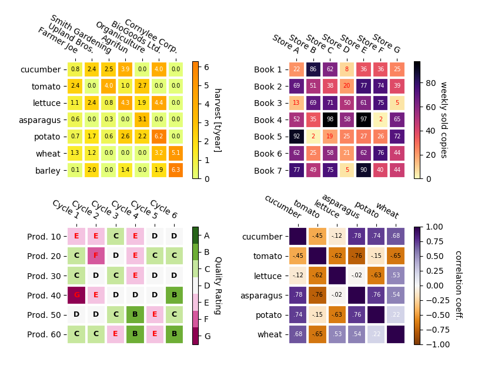
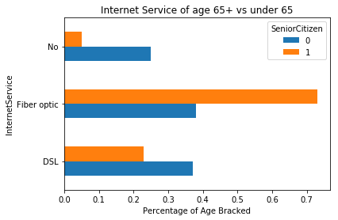
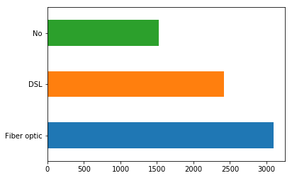

# Categorical Variables

For today's example let's investigate a dataset conscerning consumer churn for telecoms.  
This dataset comes from kaggle: https://www.kaggle.com/blastchar/telco-customer-churn/home 

Import the dataset below.


```python
#Import and preview dataset here
import pandas as pd
df = pd.read_csv('WA_Fn-UseC_-Telco-Customer-Churn.csv')
print(len(df), df.columns)
df.head()
```

    7043 Index(['customerID', 'gender', 'SeniorCitizen', 'Partner', 'Dependents',
           'tenure', 'PhoneService', 'MultipleLines', 'InternetService',
           'OnlineSecurity', 'OnlineBackup', 'DeviceProtection', 'TechSupport',
           'StreamingTV', 'StreamingMovies', 'Contract', 'PaperlessBilling',
           'PaymentMethod', 'MonthlyCharges', 'TotalCharges', 'Churn'],
          dtype='object')


<div>
<style scoped>
    .dataframe tbody tr th:only-of-type {
        vertical-align: middle;
    }

    .dataframe tbody tr th {
        vertical-align: top;
    }

    .dataframe thead th {
        text-align: right;
    }
</style>
<table border="1" class="dataframe">
  <thead>
    <tr style="text-align: right;">
      <th></th>
      <th>customerID</th>
      <th>gender</th>
      <th>SeniorCitizen</th>
      <th>Partner</th>
      <th>Dependents</th>
      <th>tenure</th>
      <th>PhoneService</th>
      <th>MultipleLines</th>
      <th>InternetService</th>
      <th>OnlineSecurity</th>
      <th>...</th>
      <th>DeviceProtection</th>
      <th>TechSupport</th>
      <th>StreamingTV</th>
      <th>StreamingMovies</th>
      <th>Contract</th>
      <th>PaperlessBilling</th>
      <th>PaymentMethod</th>
      <th>MonthlyCharges</th>
      <th>TotalCharges</th>
      <th>Churn</th>
    </tr>
  </thead>
  <tbody>
    <tr>
      <th>0</th>
      <td>7590-VHVEG</td>
      <td>Female</td>
      <td>0</td>
      <td>Yes</td>
      <td>No</td>
      <td>1</td>
      <td>No</td>
      <td>No phone service</td>
      <td>DSL</td>
      <td>No</td>
      <td>...</td>
      <td>No</td>
      <td>No</td>
      <td>No</td>
      <td>No</td>
      <td>Month-to-month</td>
      <td>Yes</td>
      <td>Electronic check</td>
      <td>29.85</td>
      <td>29.85</td>
      <td>No</td>
    </tr>
    <tr>
      <th>1</th>
      <td>5575-GNVDE</td>
      <td>Male</td>
      <td>0</td>
      <td>No</td>
      <td>No</td>
      <td>34</td>
      <td>Yes</td>
      <td>No</td>
      <td>DSL</td>
      <td>Yes</td>
      <td>...</td>
      <td>Yes</td>
      <td>No</td>
      <td>No</td>
      <td>No</td>
      <td>One year</td>
      <td>No</td>
      <td>Mailed check</td>
      <td>56.95</td>
      <td>1889.5</td>
      <td>No</td>
    </tr>
    <tr>
      <th>2</th>
      <td>3668-QPYBK</td>
      <td>Male</td>
      <td>0</td>
      <td>No</td>
      <td>No</td>
      <td>2</td>
      <td>Yes</td>
      <td>No</td>
      <td>DSL</td>
      <td>Yes</td>
      <td>...</td>
      <td>No</td>
      <td>No</td>
      <td>No</td>
      <td>No</td>
      <td>Month-to-month</td>
      <td>Yes</td>
      <td>Mailed check</td>
      <td>53.85</td>
      <td>108.15</td>
      <td>Yes</td>
    </tr>
    <tr>
      <th>3</th>
      <td>7795-CFOCW</td>
      <td>Male</td>
      <td>0</td>
      <td>No</td>
      <td>No</td>
      <td>45</td>
      <td>No</td>
      <td>No phone service</td>
      <td>DSL</td>
      <td>Yes</td>
      <td>...</td>
      <td>Yes</td>
      <td>Yes</td>
      <td>No</td>
      <td>No</td>
      <td>One year</td>
      <td>No</td>
      <td>Bank transfer (automatic)</td>
      <td>42.30</td>
      <td>1840.75</td>
      <td>No</td>
    </tr>
    <tr>
      <th>4</th>
      <td>9237-HQITU</td>
      <td>Female</td>
      <td>0</td>
      <td>No</td>
      <td>No</td>
      <td>2</td>
      <td>Yes</td>
      <td>No</td>
      <td>Fiber optic</td>
      <td>No</td>
      <td>...</td>
      <td>No</td>
      <td>No</td>
      <td>No</td>
      <td>No</td>
      <td>Month-to-month</td>
      <td>Yes</td>
      <td>Electronic check</td>
      <td>70.70</td>
      <td>151.65</td>
      <td>Yes</td>
    </tr>
  </tbody>
</table>
<p>5 rows × 21 columns</p>
</div>


#### If you haven't already, use pd.plotting.scatter_matrix(df) to see a full distribution of variables and their pairwise correlations.


```python
pd.plotting.scatter_matrix(df)
```


    array([[<matplotlib.axes._subplots.AxesSubplot object at 0x113457d30>,
            <matplotlib.axes._subplots.AxesSubplot object at 0x1188660b8>,
            <matplotlib.axes._subplots.AxesSubplot object at 0x11888f550>],
           [<matplotlib.axes._subplots.AxesSubplot object at 0x1188b7be0>,
            <matplotlib.axes._subplots.AxesSubplot object at 0x1188e92b0>,
            <matplotlib.axes._subplots.AxesSubplot object at 0x1188e92e8>],
           [<matplotlib.axes._subplots.AxesSubplot object at 0x118938fd0>,
            <matplotlib.axes._subplots.AxesSubplot object at 0x1189666a0>,
            <matplotlib.axes._subplots.AxesSubplot object at 0x11898cd30>]],
          dtype=object)


Notice that none of these variables have any correlation. Also note how the scatter plots form geometric rows and columns in a grid fashion. This is due to these variables taking on discrete rather then continuous values. The most extreme of which is the SeniorCitizen feature. If we examine this feature, we will not that there are only 2 associated values: 0 and 1, denoting a binary flag for whether or not an individual is a senior citizen. In cases of categorical variables like this (preferable ones with a limited number of associated values) a heatmap is a wonderful option for exploring the relationship between variables.

# Heatmaps
If we want to explore the relationship between categorical variables, we have no direct way of plotting these on a numeric X and Y axis. Instead, we can use heatmaps which are quiet similar to the pd.plotting.scatter_matrix(df) above. The heatmap will list all categorical variables on the X and Y axis. Each cell will then be the raw or normalized count of observations containing both of these attributes.

Here's a few examples:


Let's investigate doing this for our current dataset.


```python
df.head(2)
```


<div>
<style scoped>
    .dataframe tbody tr th:only-of-type {
        vertical-align: middle;
    }

    .dataframe tbody tr th {
        vertical-align: top;
    }

    .dataframe thead th {
        text-align: right;
    }
</style>
<table border="1" class="dataframe">
  <thead>
    <tr style="text-align: right;">
      <th></th>
      <th>customerID</th>
      <th>gender</th>
      <th>SeniorCitizen</th>
      <th>Partner</th>
      <th>Dependents</th>
      <th>tenure</th>
      <th>PhoneService</th>
      <th>MultipleLines</th>
      <th>InternetService</th>
      <th>OnlineSecurity</th>
      <th>...</th>
      <th>DeviceProtection</th>
      <th>TechSupport</th>
      <th>StreamingTV</th>
      <th>StreamingMovies</th>
      <th>Contract</th>
      <th>PaperlessBilling</th>
      <th>PaymentMethod</th>
      <th>MonthlyCharges</th>
      <th>TotalCharges</th>
      <th>Churn</th>
    </tr>
  </thead>
  <tbody>
    <tr>
      <th>0</th>
      <td>7590-VHVEG</td>
      <td>Female</td>
      <td>0</td>
      <td>Yes</td>
      <td>No</td>
      <td>1</td>
      <td>No</td>
      <td>No phone service</td>
      <td>DSL</td>
      <td>No</td>
      <td>...</td>
      <td>No</td>
      <td>No</td>
      <td>No</td>
      <td>No</td>
      <td>Month-to-month</td>
      <td>Yes</td>
      <td>Electronic check</td>
      <td>29.85</td>
      <td>29.85</td>
      <td>No</td>
    </tr>
    <tr>
      <th>1</th>
      <td>5575-GNVDE</td>
      <td>Male</td>
      <td>0</td>
      <td>No</td>
      <td>No</td>
      <td>34</td>
      <td>Yes</td>
      <td>No</td>
      <td>DSL</td>
      <td>Yes</td>
      <td>...</td>
      <td>Yes</td>
      <td>No</td>
      <td>No</td>
      <td>No</td>
      <td>One year</td>
      <td>No</td>
      <td>Mailed check</td>
      <td>56.95</td>
      <td>1889.5</td>
      <td>No</td>
    </tr>
  </tbody>
</table>
<p>2 rows × 21 columns</p>
</div>


We first need to choose to variables to compare. Let's examine SeniorCitizen vs InternetService. Perhaps these have an interesting relationship. The first thing we need to do is construct a matrix similar to the visuals shown above.
Let's look at what the values of these two columns are:


```python
print(df.SeniorCitizen.value_counts())
```

    0    5901
    1    1142
    Name: SeniorCitizen, dtype: int64


```python
print(df.InternetService.value_counts())
```

    Fiber optic    3096
    DSL            2421
    No             1526
    Name: InternetService, dtype: int64


Given these values we will need to construct a matrix like this:

|           |SeniorCitizen0|SeniorCitizen1 |
|:---------:|:------------:| -------------:|
|Fiber Optic|number/percent|number/percent |
|DSL        |number/percent|number/percent |
|NO         |number/percent|number/percent |


```python
df[['SeniorCitizen', 'InternetService']].head()
```


<div>
<style scoped>
    .dataframe tbody tr th:only-of-type {
        vertical-align: middle;
    }

    .dataframe tbody tr th {
        vertical-align: top;
    }

    .dataframe thead th {
        text-align: right;
    }
</style>
<table border="1" class="dataframe">
  <thead>
    <tr style="text-align: right;">
      <th></th>
      <th>SeniorCitizen</th>
      <th>InternetService</th>
    </tr>
  </thead>
  <tbody>
    <tr>
      <th>0</th>
      <td>0</td>
      <td>DSL</td>
    </tr>
    <tr>
      <th>1</th>
      <td>0</td>
      <td>DSL</td>
    </tr>
    <tr>
      <th>2</th>
      <td>0</td>
      <td>DSL</td>
    </tr>
    <tr>
      <th>3</th>
      <td>0</td>
      <td>DSL</td>
    </tr>
    <tr>
      <th>4</th>
      <td>0</td>
      <td>Fiber optic</td>
    </tr>
  </tbody>
</table>
</div>


# ETL Challenge!  
Extract Transform Load! A lot of data science is transforming and manipulating data.  
How can you transform these two columns into the desired matrix form above?!  


```python
#Step 1: Group!
grouped = df.groupby('SeniorCitizen')['InternetService'].value_counts(normalize=True).map(lambda x: round(x,2))
grouped = pd.DataFrame(grouped)
grouped.columns = ['Count']
grouped = grouped.reset_index()
print(grouped.Count.sum())
grouped
```

    2.01


<div>
<style scoped>
    .dataframe tbody tr th:only-of-type {
        vertical-align: middle;
    }

    .dataframe tbody tr th {
        vertical-align: top;
    }

    .dataframe thead th {
        text-align: right;
    }
</style>
<table border="1" class="dataframe">
  <thead>
    <tr style="text-align: right;">
      <th></th>
      <th>SeniorCitizen</th>
      <th>InternetService</th>
      <th>Count</th>
    </tr>
  </thead>
  <tbody>
    <tr>
      <th>0</th>
      <td>0</td>
      <td>Fiber optic</td>
      <td>0.38</td>
    </tr>
    <tr>
      <th>1</th>
      <td>0</td>
      <td>DSL</td>
      <td>0.37</td>
    </tr>
    <tr>
      <th>2</th>
      <td>0</td>
      <td>No</td>
      <td>0.25</td>
    </tr>
    <tr>
      <th>3</th>
      <td>1</td>
      <td>Fiber optic</td>
      <td>0.73</td>
    </tr>
    <tr>
      <th>4</th>
      <td>1</td>
      <td>DSL</td>
      <td>0.23</td>
    </tr>
    <tr>
      <th>5</th>
      <td>1</td>
      <td>No</td>
      <td>0.05</td>
    </tr>
  </tbody>
</table>
</div>


```python
#Step 2: Pivot!
heat_matrix = grouped.pivot(index='InternetService', columns='SeniorCitizen', values='Count')
heat_matrix.head()
```


<div>
<style scoped>
    .dataframe tbody tr th:only-of-type {
        vertical-align: middle;
    }

    .dataframe tbody tr th {
        vertical-align: top;
    }

    .dataframe thead th {
        text-align: right;
    }
</style>
<table border="1" class="dataframe">
  <thead>
    <tr style="text-align: right;">
      <th>SeniorCitizen</th>
      <th>0</th>
      <th>1</th>
    </tr>
    <tr>
      <th>InternetService</th>
      <th></th>
      <th></th>
    </tr>
  </thead>
  <tbody>
    <tr>
      <th>DSL</th>
      <td>0.37</td>
      <td>0.23</td>
    </tr>
    <tr>
      <th>Fiber optic</th>
      <td>0.38</td>
      <td>0.73</td>
    </tr>
    <tr>
      <th>No</th>
      <td>0.25</td>
      <td>0.05</td>
    </tr>
  </tbody>
</table>
</div>


## Adding the Visual


```python
import numpy as np
import matplotlib
import matplotlib.pyplot as plt
import seaborn as sns
```


```python
y_labels = heat_matrix.index
x_labels = heat_matrix.columns
data = np.array(heat_matrix)


fig, ax = plt.subplots()
im = ax.imshow(data, cmap='Blues')

# We want to show all ticks...
ax.set_xticks(np.arange(len(x_labels)))
ax.set_yticks(np.arange(len(y_labels)))
# ... and label them with the respective list entries
ax.set_xticklabels(x_labels)
ax.set_yticklabels(y_labels)

# Rotate the tick labels and set their alignment.
plt.setp(ax.get_xticklabels(), rotation=45, ha="right",
         rotation_mode="anchor")

# Loop over data dimensions and create text annotations.
for i in range(len(y_labels)):
    for j in range(len(x_labels)):
        value = data[i, j]
        if value < .5:
            text_color = 'black'
        else:
            text_color = 'white'
        text = ax.text(j, i, value,
                       ha="center", va="center", color=text_color)

ax.set_title("Internet Service of age 65+ vs <65")

# Create colorbar
cbar = ax.figure.colorbar(im, ax=ax)
cbar.ax.set_ylabel('Age Group Percentage', rotation=-90, va="bottom")

plt.xlabel('Senior Citizen Flag')
plt.ylabel('Type of Internet Service')
fig.tight_layout()
plt.show()
```


```python
#Compare this to our previous bar charts.....
heat_matrix.plot(kind='barh')
plt.title('Internet Service of age 65+ vs under 65')
plt.xlabel('Percentage of Age Bracked')
```


    Text(0.5,0,'Percentage of Age Bracked')





## Feature Engineering Categorical Variables to Numerical Binary Flags
Another common technique that we'll need going forward is to turn categorical variables into binary flags in order perform standard algorithms which only accept numerical values. One easy option is to use pandas built in **pd.get_dummies()** method in order to turn a categorical variable into multiple columns, each corresponding to a category along with a binary flag for whether that particular observation is in the given category.


```python
example = df.sample(5, np.random.seed(2)).InternetService # I chose a sample in order to show multiple values. 
#np.random.seed(2) sets it to a specific 'random' number. This ensures that the output is consistent.
example
```


    5806             No
    3678            DSL
    4060            DSL
    1577    Fiber optic
    5007             No
    Name: InternetService, dtype: object


```python
pd.get_dummies(example).head()
```


<div>
<style scoped>
    .dataframe tbody tr th:only-of-type {
        vertical-align: middle;
    }

    .dataframe tbody tr th {
        vertical-align: top;
    }

    .dataframe thead th {
        text-align: right;
    }
</style>
<table border="1" class="dataframe">
  <thead>
    <tr style="text-align: right;">
      <th></th>
      <th>DSL</th>
      <th>Fiber optic</th>
      <th>No</th>
    </tr>
  </thead>
  <tbody>
    <tr>
      <th>5806</th>
      <td>0</td>
      <td>0</td>
      <td>1</td>
    </tr>
    <tr>
      <th>3678</th>
      <td>1</td>
      <td>0</td>
      <td>0</td>
    </tr>
    <tr>
      <th>4060</th>
      <td>1</td>
      <td>0</td>
      <td>0</td>
    </tr>
    <tr>
      <th>1577</th>
      <td>0</td>
      <td>1</td>
      <td>0</td>
    </tr>
    <tr>
      <th>5007</th>
      <td>0</td>
      <td>0</td>
      <td>1</td>
    </tr>
  </tbody>
</table>
</div>


# Connecting Representations
Notice how summing these columns is then the same as using the **.value_counts()** method on the original series:


```python
pd.get_dummies(df.InternetService).sum().sort_values(ascending=False).plot(kind='barh')
```


    <matplotlib.axes._subplots.AxesSubplot at 0x1a239b2240>


```python
df.InternetService.value_counts().plot(kind='barh')
```


    <matplotlib.axes._subplots.AxesSubplot at 0x1a23af1fd0>




